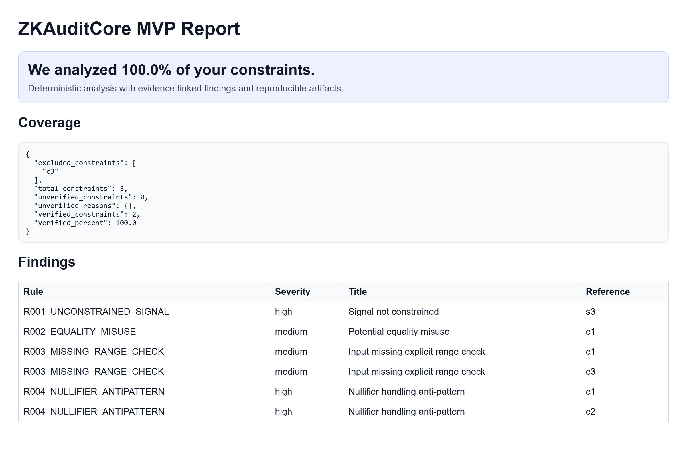

# ZKAuditCore

ZKAuditCore is a deterministic CLI that produces coverage-aware, reproducible audit reports for zero-knowledge circuits.

## ⚡ Quick Demo

Run a full deterministic audit on a sample circuit:

```bash
zk-auditcore analyze fixtures/circuits/vulnerable_sample.json --out-dir artifacts_demo
zk-auditcore verify --out-dir artifacts_demo
```

What you'll get:

- Coverage headline: `We analyzed 100.0% of your constraints.`
- Evidence-linked findings (rule + constraint + solver status)
- Signed attestation manifest

Artifacts generated:

- `report.html`
- `coverage.json`
- `findings.json`
- `attestation.json`

### 📊 Sample Report Output



### Example Output (CLI)

```text
Findings: 6
Coverage verified: 100.0%
Attestation manifest verified.
```

Deterministic, coverage-aware, exploit-oriented analysis for zero-knowledge circuits.

ZKAuditCore is a CLI-first security analysis pipeline that generates reproducible, evidence-linked audit artifacts for ZK systems. It is designed to support human auditors with verifiable outputs rather than probabilistic heuristics.

## Why ZKAuditCore

- Deterministic execution (same input -> same output)
- Constraint-level coverage metrics (explicitly measured)
- Evidence-backed findings (rule + solver traceability)
- Reproducible audit artifacts with attestation
- CI-friendly for repeatable security workflows

## MVP Scope (Phase 1)

- Circom-oriented ingestion to typed analysis IR
- Constraint dependency graph construction
- Static rule engine with extensible rule contracts
- Z3 integration with `SAT` / `UNSAT` / `UNKNOWN` semantics
- Coverage calculator with reason-tagged unverified sets
- JSON + HTML report exports with evidence references
- Attestation manifest + signature status output

## Repository Layout

- `src/zk_auditcore/cli` - CLI commands (`analyze`, `report`, `attest`, `verify`, `replay`)
- `src/zk_auditcore/parsers` - parser adapters and ingestion entry points
- `src/zk_auditcore/ir` - typed IR models and dependency graphing
- `src/zk_auditcore/rules` - rule engine and built-in checks
- `src/zk_auditcore/solver` - SMT execution adapters
- `src/zk_auditcore/coverage` - defensible coverage metrics
- `src/zk_auditcore/attestation` - reproducibility and signing hooks
- `src/zk_auditcore/reporting` - schema and exporters
- `src/zk_auditcore/pipeline` - end-to-end orchestration
- `fixtures/circuits` - sample vulnerable inputs
- `tests` - integration validation suite

## Quick Start

1. Use Python `3.11+`.
2. Install dependencies:
   - `pip install -e .[dev]`
3. Run analysis:
   - `zk-auditcore analyze fixtures/circuits/vulnerable_sample.json --out-dir artifacts`
4. Verify attestation manifest:
   - `zk-auditcore verify --out-dir artifacts`

## Simple Launch Checklist

Before showing to a pilot user or partner, ensure all of the following are true:

- CLI works on at least 1 circuit (`analyze` succeeds)
- Output includes JSON and a readable report (`findings.json`, `coverage.json`, `report.html`)
- Coverage percentage is clearly visible in terminal and report
- Output contains at least 1 finding
- README is clear and runnable by a new user
- Example circuit is included in the repository

## Expected Demo Output

Typical successful run includes:

- `Findings: <n>`
- `Coverage verified: <x>%`
- `Attestation manifest verified.`

The HTML report prominently highlights:

- `We analyzed 100.0% of your constraints.`

## Output Artifacts

An analysis run emits:

- `findings.json`
- `coverage.json`
- `report.html`
- `attestation.json`
- `attestation_status.json`

## Engineering Principles

- LLM outputs (when used for narrative reporting) must remain schema-bound and evidence-grounded.
- Cryptographic reasoning is delegated to deterministic engines and typed rule logic.
- Coverage claims must remain explainable and reproducible.
- Human sign-off remains mandatory for audit conclusions.

## Development

- Lint: `ruff check src tests`
- Type check: `mypy src`
- Test: `pytest -q`

See `CONTRIBUTING.md` for contribution workflow and `SECURITY.md` for vulnerability reporting.
